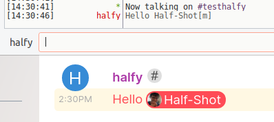

# Using the bridge

This chapter describes how to use the bridge and is intended for new or experienced Matrix
users.

## Getting connected

The IRC bridge will dynamically connect you to IRC when you start interacting with an IRC bridged room.
Some bridges, such as matrix.org, will connect you to IRC and join you to a channel the moment you join
the Matrix room. Others will only connect you to IRC when you attempt to send a message to a Matrix channel.

Once you are connected to IRC, any joins you make to rooms connected to IRC will be replicated as joins to the
IRC channel.

By default your nickname will be `YourDisplayname-M`, but some bridges may alter this default by using a `[m]` suffix
instead. See the [Admin Room](./admin_room) section for help with changing your nickname.

### Connection Persistence

The IRC bridge will drop all IRC connections on restart. This can manifest in a flood of QUITs on IRC channels,
and will also mean that upon reconnection you may not be authenticated with services.

### Authentication

Most networks provide a mechanism for one to authenticate themselves. You can do this manually by messaging NickServ or by providing
a password to the bridge itself. See the [Admin Room](./admin_room) section for help.
## Message behaviours

Messages from IRC to Matrix appear in roughly as you'd expect them to. Emotes (`/me` text) are applied as Matrix supports
it, and mIRC format colours are applied too. The IRC bridge makes an attempt to replace nicknames in sent messages with 
user mention "pills".

